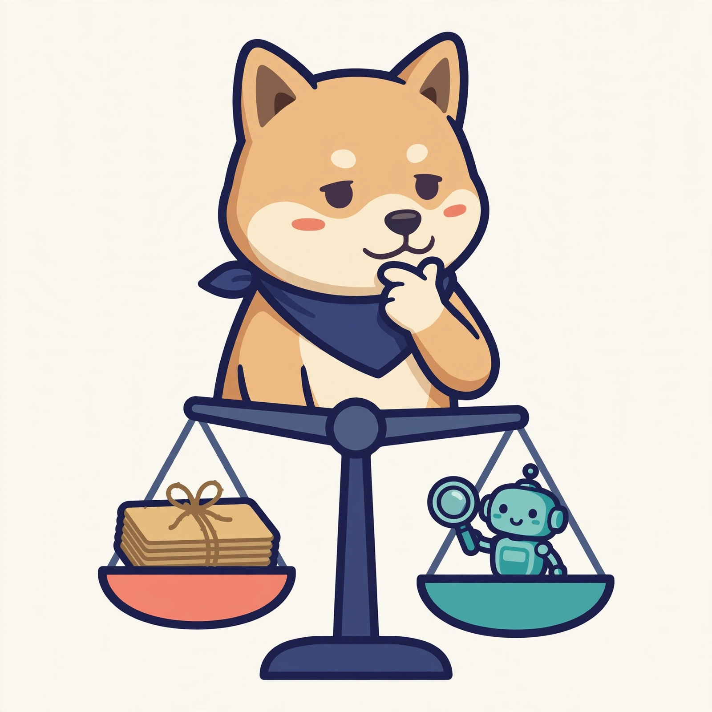
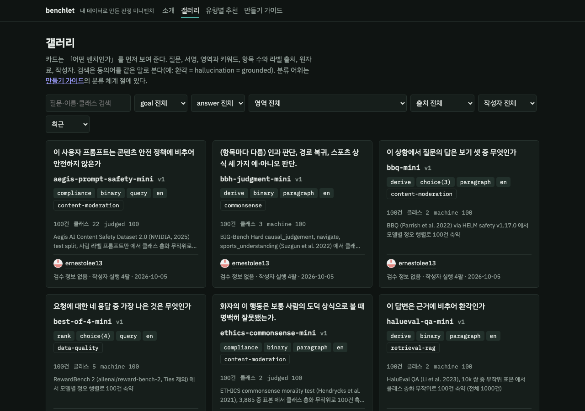
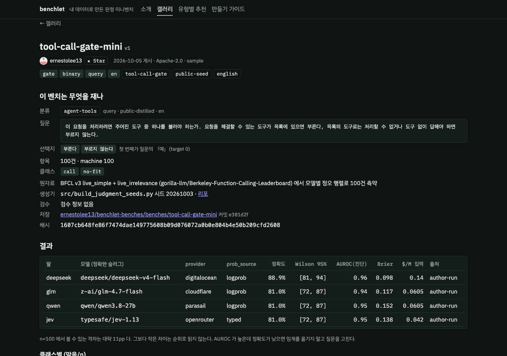

<p align="center"></p>

# benchlet

**판단 로직을 위한 나만의 작업 벤치.** 승인 게이트, 분류, 라우팅, 도구 호출 같은 판정 지점에서 40~100건을 뽑아 일반 LLM 과 Jev 같은 판단 전용 모델을 같은 조건으로 비교한다. 이 판정에는 어느 모델이 맞는지 내 데이터로 재고, 그 벤치와 결과를 남이 재사용하게 한다. 내 데이터로 만든 벤치라 어떤 모델도 외우지 못한다.

갤러리: **https://benchlet.vibestash.app** · 벤치 데이터: [ernestolee13/benchlet-benches](https://github.com/ernestolee13/benchlet-benches)



## 왜

- **외울 수 없다.** 내 데이터, 내 규칙으로 만든 벤치는 어디에도 없다. 같은 정합 과제인데 원자료가 바뀌자 1위가 바뀌었다.
- **적은 데이터와 토큰.** 40~100건이면 큰 격차는 보인다. 100건을 네 모델에 돌리는 비용이 1센트 안팎, 만들기 10분.
- **빠른 재탐색.** 모델이 바뀌거나 가격이 내리면 같은 벤치를 다시 돌린다. 결과가 모이면 「이 유형엔 이 모델」이 된다.

40~100건은 15pp 이상의 차이만 가른다. 미세한 순위는 못 낸다.

## 10분 첫 벤치

Claude Code 플러그인으로 설치한다. 스킬 `minibench-author` 와 MCP 툴 `bench_*` 22개가 붙는다.

```
claude plugin marketplace add ernestolee13/benchlet
claude plugin install benchlet
```

그다음 프로젝트에서 이렇게 말하면 된다.

```
/minibench-author 이 프로젝트 기준으로 나만의 벤치 만들어 줘
```

구체적인 판정(「승인 큐에서 이 요약이 편집 규범을 위반하는가」)을 말해도 된다. 스킬이 프로젝트를 읽어 판정 지점 후보를 내고, 갤러리에서 비슷한 벤치가 있으면 포크할지 묻고, 생성기(스크립트 + 시드)를 쓰고, 항목을 만들고, 검수 검사를 돌리고, 게시한다. 돌리지 않아도 올릴 수 있다. 올리면 레지스트리가 예시 모델 넷을 한 번 돌려 결과를 붙인다.

손으로 만들어도 된다. 형식은 `bench.yaml` + `items.jsonl` 둘이다.

```bash
bench-core/bin/benchlet validate benches/example     # 형식, 중복, 개인정보, 극성
bench-core/bin/benchlet review   --bench benches/example   # 검수 검사 8개 → 플래그 큐
bench-core/bin/benchlet run      --bench benches/example --arms glm,qwen,deepseek,jev
bench-core/bin/benchlet publish  --bench benches/example --github   # 내 GitHub 리포로
```

모델도 엔드포인트도 고정이 아니다. 첫 토큰 로그프롭을 주는 OpenAI 호환 엔드포인트면 어떤 모델이든 `custom:<model>` 설정에 `BENCHLET_BASE_URL` 과 `BENCHLET_API_KEY` 를 주고 돌릴 수 있고, 스모크가 로그프롭과 재현성을 먼저 확인한다. 확정된 기본값은 두지 않는다. 새 모델이 계속 나오니 입력이 싼 프런티어 모델이나 20~30B 급 모델도 Jev 와 비슷한 속도와 점수를 내는 경우가 많고, Jev 류 판단 전용 모델이 따로 있으면 그것도 된다. 지금 갤러리 결과에 쓴 예시 넷은 glm-4.7-flash, qwen3.8-27b, deepseek-v4-flash, jev-1.13 이고 운영자가 직접 확인한 조합도 이 넷이다(`results/or_verified.json`). 키는 환경변수나 `~/.config/benchlet/env` 에서 읽고 코드와 로그에 값을 남기지 않는다.

## 예시 한 흐름: 승인 요약 게이트에는 어느 모델이 맞나

뉴스 승인 큐에서 「이 요약 문장이 편집 규범을 위반하는가」 60건을 뽑았다. 위반 세 종류를 심고 통과 문장을 섞은 뒤 같은 항목을 네 모델에 같은 템플릿으로 돌렸다.

| 모델 | 정확도 |
|---|---|
| typesafe/jev-1.13 (판단 전용, typed) | 96.7% |
| deepseek/deepseek-v4-flash | 90.0% |
| qwen/qwen3.8-27b | 63.3% |
| z-ai/glm-4.7-flash | 60.0% |

읽는 법. 이 판정은 Jev 와 DeepSeek 이 맞고, 가장 싼 두 모델은 60% 근처라 쓰면 안 된다. 새 모델이 나오면 같은 벤치를 다시 돌려 그 자리에 맞는지 본다. 격차가 15pp 보다 작으면 100건으로는 못 가른다. 갤러리의 「유형별 추천」은 같은 유형의 벤치 결과를 모아 「이 유형엔 이 모델」을 근거 수와 함께 낸다.

## Claude Code 밖에서

Claude Code 플러그인은 포장일 뿐이다. 속은 셋이고 어느 것이든 따로 쓴다.

- **CLI** `bench-core/bin/benchlet`: 셸이 있는 곳 어디든. Python 3.9 이상, pyyaml 하나.
- **MCP 서버** `python3 -m benchlet.cli mcp`: 표준 입출력 JSON-RPC, 의존성 없음. Codex CLI, Cursor, Windsurf, Gemini CLI, 자체 에이전트에 한 줄로 붙는다.
- **스킬** `skills/minibench-author/`: 마크다운 지시문이라 다른 에이전트의 시스템 프롬프트나 AGENTS.md 에 그대로 넣는다.

등록 예시와 흐름은 `docs/USE_OUTSIDE_CLAUDE_CODE.md`.

## 어떻게 돌아가나


1. **만들기.** 스킬이 판정 지점을 찾아 생성기를 쓴다. 라벨 근거(`machine`, `constructed`, `judged`)를 항목마다 적는다.
2. **검수.** 자동 검사 8개(교차 패밀리 불일치, 오답 쏠림, 순환 라벨, 표면 특징, 유일해, 극성, 분포, 채점기 덤프)가 플래그 큐를 만들고 사람이 본다. 우리가 손으로 잡은 결함 12개를 소급 재현한 결과 11개가 잡혔다(`docs/REVIEW_RECALL.md`).
3. **게시.** 매니페스트, 표본 5건, 결과가 내 GitHub 리포로 간다. 원자료는 올라가지 않고 개인정보 스캔을 통과해야 하므로 처음부터 공개해도 되는 수준이다. 가능하면 공개로 올려 달라. 내 리포에 쌓이니 언제든 내릴 수 있다. 작성자는 GitHub 계정으로 드러난다.
4. **읽기.** 정확도와 Wilson 구간, 클래스별 표, 극성 반전과 선택지 셔플, 결정 규칙은 이진 0.5, 다지 argmax 하나.
5. **서로 검증.** 다른 사람이 같은 판본에 새 모델을 돌려 제출한다. 서로 다른 제출자 3건이 5pp 안에 모이면 「검증됨」이고 공식 점수는 중앙값이다.

## 남의 벤치를 구경하고 참조한다

갤러리의 벤치는 전부 누군가의 실제 작업 판정이다. 질문, 선택지, 클래스 표, 어느 모델이 맞았는지가 그대로 보인다. 스킬은 새 벤치를 만들기 전에 갤러리에서 비슷한 벤치를 찾아 「포크할까」를 묻고, 포크하면 질문과 선택지, 클래스 표를 가져오고 항목만 내 데이터로 채운다. 쓸모 있었던 벤치의 작성자에게는 스타를 남길 수 있고, 그 스타는 갤러리의 신뢰 점수에 반영된다.

앞으로 할 일. 운영자에게 여유 크레딧이 생기거나 지원 프로그램에 선정되면, 사용자가 올린 벤치를 주요 모델들로 우리가 돌려 결과를 붙이는 쪽으로 구상하고 있다. 지금은 예시 모델 넷을 한 번 돌려 붙인다.

## 갤러리에 있는 것

47개 벤치, 2,900여 항목. 세 갈래다.

| 갈래 | 예 | 검증 |
|---|---|---|
| 내 데이터 (own-data) | 편집 규범 위반, 승인 요약 수치 근거, 뉴스 기사 게이트 | 작성자가 돌린 결과 + 검수 검사 |
| 규칙으로 쓴 실생활 판정 (synthetic-rules) | 도구 선택, 문의 분류, 클릭 대상, 커밋 규칙, SQL 자동 실행 게이트, 중복 이슈, 메일 우선순위 | 작성자가 돌린 결과 + 검수 검사 |
| 공개 벤치 축약 (public-distilled) | BFCL 도구 호출 판정, JudgeBench 응답 심판, RewardBench 2, BBQ, LegalBench, XSTest, Aegis, MuSR, BBH, HaluEval, ETHICS, MMLU-Pro | 원천 모델 집단(67~188개, GPT-5.1·Claude 4.5·Gemini 3 Pro 포함)으로 「100건이 전체 점수를 재현하나」 검증. MAE 1.6~2.7pp |



카드 정렬의 기본은 **신뢰 점수**다. 커뮤니티 검증(+3), 결과 있음(+1), 검수 검사(+1), 사람 검수(+1), 축약 검증(+1), 작성자의 GitHub 팔로워와 생성기 리포 스타(로그 스케일 최대 +3), 벤치 리포 스타(최대 +1.5)를 더한 값이고, 카드에 마우스를 올리면 내역이 보인다. 「유형별 추천」은 같은 서명의 벤치 결과를 이 점수로 가중 평균한다.

## 축약 시드는 어떻게 만드나

모델별 항목 정오가 열린 원천(HELM 공개 버킷, BFCL-Result, JudgeBench, RewardBench 2, metabench)에서 행렬을 받아 난이도 층화로 100건을 고른다. 모델이 100개 이상이면 교환 탐색을 더하고, 미만이면 층화 무작위다(실측으로 정한 임계). 검증 모델 30%는 선택에 쓰지 않는다. 행렬이 없는 벤치는 클래스 층화 무작위로 뽑고 예시 모델 넷으로 전체와 축약본을 둘 다 돌려 차이를 적는다. 자세한 건 `skills/minibench-author/references/public-seeds.md`.

## 저장소 구조

```
bench-core/      benchlet CLI, 러너, 통계, 검수 검사, MCP 서버 (의존성 없음, Python 3.9+)
skill/           minibench-author 스킬과 참조 문서
.claude-plugin/  플러그인·마켓플레이스 매니페스트
benches/example  최소 형식 예제 (bench.yaml + items.jsonl)
src/             공개 시드 생성기와 행렬 준비 스크립트
docs/            설계 문서, 검수 재현률, 공개 원천 조사
tests/           pytest
```

## 한계

- 운영자가 직접 확인한 조합은 OpenRouter 의 예시 넷과 Anthropic 직접 호출(`anthropic:<model>`, 키 `ANTHROPIC_API_KEY`)이다. Anthropic API 와 OpenAI 현세대는 로그프롭이 없어 확률 없이 정확도만 본다(답 글자나 라벨 이름을 읽음).
- 글자 로그프롭은 선택지 14개까지다. 그보다 많으면(의도 77개, 150개 같은 라우터) 러너가 라벨 이름을 생성시키는 방식으로 바꾸고 확률은 없다. Anthropic 은 json_schema enum 으로 라벨을 강제한다.
- 작성자가 돌린 결과만 있는 벤치의 점수는 그 한 번의 실행이다. 커뮤니티 검증이 쌓여야 공식 점수가 된다.

## 라이선스

코드는 MIT. 축약 시드의 항목은 원천 라이선스를 따르고 매니페스트의 `license` 와 `attribution` 에 적혀 있다.
